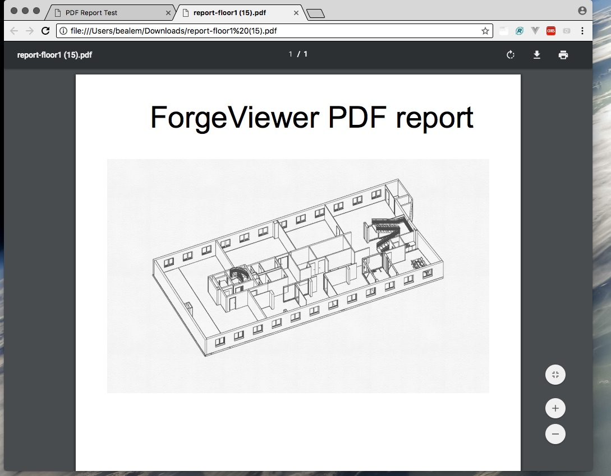

# Generate a PDF Report from LMV Canvas

Use Forge Viewer to create a PDF report (client side only)



## Introduction

Here is a quick way to generate a PDF report of the LMV canvas through the browser.
It uses the [jsPDF](https://parall.ax/products/jspdf) library.

#### [DEMO](https://wallabyway.github.io/forge-pdf-report/)

#### [Results.PDF](report-floor1.pdf)


# How to use:

Steps:

1. Add `<script src="https://unpkg.com/jspdf/dist/jspdf.min.js"></script>` to your `index.html`
2. Take a screenshot of LMV canvas using [`getScreenShotBuffer()`](https://developer.autodesk.com/en/docs/viewer/v2/reference/javascript/viewer3d#function:getscreenshot), like this ...

```
viewer.getScreenShotBuffer(
 viewer.canvas.width,
 viewer.canvas.height, 
 img => createPDF(img)); });
```
        

3. Then add the PNG into a new PDF using jsPDF, like this...

```
var doc = new jsPDF()
doc.addImage(imgData, 'JPEG', 0, 40, 180, 120);
doc.save('Floor1_PDFreport.pdf')
```

You can find a complete example GitHub here: [https://github.com/wallabyway/forge-pdf-report](https://github.com/wallabyway/forge-pdf-report)

Feel free to add any issues you find to my Github [issues repo](https://github.com/wallabyway/forge-pdf-report/issues).

Follow me on [Twitter @micbeale](http://twitter.com/micbeale)

